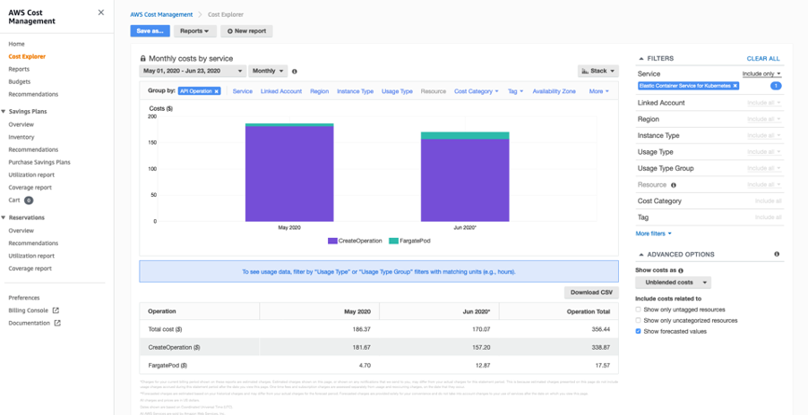
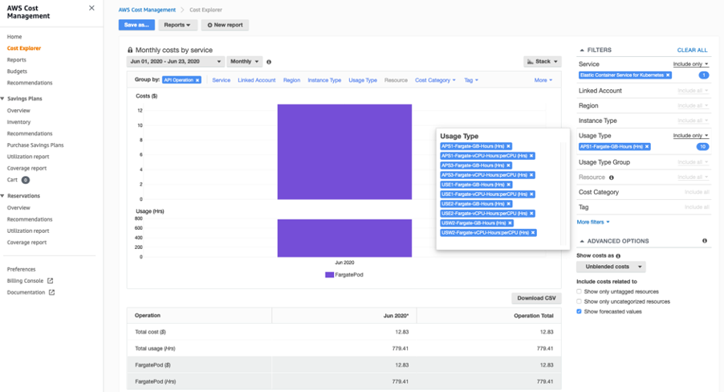
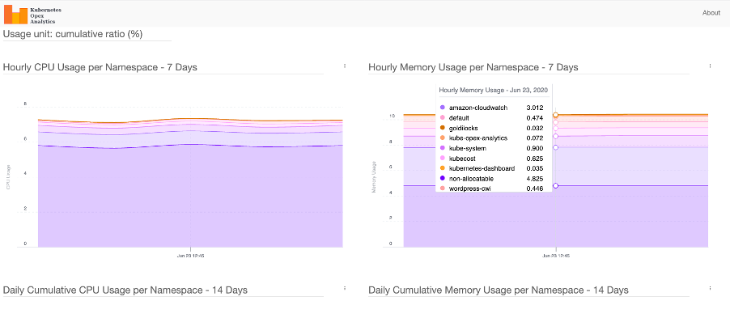
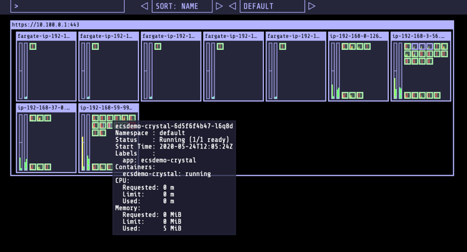

# Expenditure awareness

Expenditure awareness is understanding who, where and what is causing expenditures in your EKS cluster. Getting an accurate picture of this data will help raise awareness of your spend and highlight areas to remediate.


## Recommendations
### Use Cost Explorer

[AWS Cost Explorer](https://aws.amazon.com/aws-cost-management/aws-cost-explorer/) has an easy-to-use interface that lets you visualize, understand, and manage your AWS costs and usage over time. You can analyze cost and usage data, at various levels using the filters available in Cost Explorer.

#### EKS Control Plane and EKS Fargate costs

Using the filters, we can query the costs incurred for the EKS costs at the Control Plane and Fargate Pod as shown in the diagram below:



Using the filters, we can query the aggregate costs incurred for the Fargate Pods across regions in EKS - which includes both vCPU-Hours per CPU and GB Hrs as shown in the diagram below:



#### Tagging of Resources

Amazon EKS supports [adding AWS tags](https://docs.aws.amazon.com/eks/latest/userguide/eks-using-tags.html) to your Amazon EKS clusters. This makes it easy to control access to the EKS API for managing your clusters. Tags added to an EKS cluster are specific to the AWS EKS cluster resource, they do not propagate to other AWS resources used by the cluster such as EC2 instances or load balancers. Today, cluster tagging is supported for all new and existing EKS clusters via the AWS API, Console, and SDKs.

AWS Fargate is a technology that provides on-demand, right-sized compute capacity for containers. Before you can schedule pods on Fargate in your cluster, you must define at least one Fargate profile that specifies which pods should use Fargate when they are launched. 

Adding and Listing tags to an EKS cluster:
```
$ aws eks tag-resource --resource-arn arn:aws:eks:us-west-2:xxx:cluster/ekscluster1 --tags team=devops,env=staging,bu=cio,costcenter=1234
$ aws eks list-tags-for-resource --resource-arn arn:aws:eks:us-west-2:xxx:cluster/ekscluster1
{
    "tags": {
        "bu": "cio",
        "env": "staging",
        "costcenter": "1234",
        "team": "devops"
    }
}
```
After you activate cost allocation tags in the [AWS Cost Explorer](https://docs.aws.amazon.com/awsaccountbilling/latest/aboutv2/cost-alloc-tags.html), AWS uses the cost allocation tags to organize your resource costs on your cost allocation report, to make it easier for you to categorize and track your AWS costs.

Tags don't have any semantic meaning to Amazon EKS and are interpreted strictly as a string of characters. For example, you can define a set of tags for your Amazon EKS clusters to help you track each cluster's owner and stack level.

### Use AWS Trusted Advisor

AWS Trusted Advisor offers a rich set of best practice checks and recommendations across five categories: cost optimization; security; fault tolerance; performance; and service limits.

For Cost Optimization, Trusted Advisor helps eliminate unused and idle resources and recommends making commitments to reserved capacity. The key action items that will help Amazon EKS will be around low utilsed EC2 instances, unassociated Elastic IP addresses, Idle Load Balancers, underutilized EBS volumes among other things. The complete list of checks are provided at https://aws.amazon.com/premiumsupport/technology/trusted-advisor/best-practice-checklist/. 

The Trusted Advisor also provides Savings Plans and Reserved Instances recommendations for EC2 instances and Fargate which allows you to commit to a consistent usage amount in exchange for discounted rates. 

!!! Note
    that the recommendations from Trusted Advisor are generic recommendations and not specific to EKS. 

### Use the Kubernetes dashboard 

***Kubernetes dashboard***

Kubernetes Dashboard is a general purpose, web-based UI for Kubernetes clusters, which provides information about the Kubernetes cluster including the resource usage at a cluster, node and pod level. The deployment of the Kubernetes dashboard on an Amazon EKS cluster is described in the [Amazon EKS documentation](https://docs.aws.amazon.com/eks/latest/userguide/dashboard-tutorial.html). 

Dashboard provides resource usage breakdowns for each node and pod, as well as detailed metadata about pods, services, Deployments, and other Kubernetes objects. This consolidated information provides visibility into your Kubernetes environment.


***kubectl top and describe commands***

Viewing resource usage metrics with kubectl top and kubectl describe commands. kubectl top will show current CPU and memory usage for the pods or nodes across your cluster, or for a specific pod or node. The kubectl describe command will give more detailed information about a specific node or a pod.
```
$ kubectl top pods
$ kubectl top nodes
$ kubectl top pod pod-name --namespace mynamespace --containers
```

Using the top command, the output will displays the total amount of CPU (in cores) and memory (in MiB) that the node is using, and the percentages of the node’s allocatable capacity those numbers represent. You can then drill-down to the next level, container level within pods by adding a *--containers* flag. 


```
$ kubectl describe node <node>
$ kubectl describe pod <pod>
```

*kubectl describe* returns the percent of total available capacity that each resource request or limit represents. 

kubectl top and describe, track the utilization and availability of critical resources such as CPU, memory, and storage across kubernetes pods, nodes and containers. This awareness will help in understanding resource usage and help in controlling costs. 


### Use CloudWatch Container Insights

Use [CloudWatch Container Insights](https://docs.aws.amazon.com/AmazonCloudWatch/latest/monitoring/deploy-container-insights-EKS.html) to collect, aggregate, and summarize metrics and logs from your containerized applications and microservices. Container Insights is available for Amazon Elastic Kubernetes Service on EC2, and Kubernetes platforms on Amazon EC2. The metrics include utilization for resources such as CPU, memory, disk, and network. 

The installation of insights is given in the [documentation](https://docs.aws.amazon.com/AmazonCloudWatch/latest/monitoring/deploy-container-insights-EKS.html).

CloudWatch creates aggregated metrics at the cluster, node, pod, task, and service level as CloudWatch metrics. 

**The following query shows a list of nodes, sorted by average node CPU utilization**
```
STATS avg(node_cpu_utilization) as avg_node_cpu_utilization by NodeName
| SORT avg_node_cpu_utilization DESC 
```

**CPU usage by Container name**
```
stats pct(container_cpu_usage_total, 50) as CPUPercMedian by kubernetes.container_name 
| filter Type="Container"
```
**Disk usage by Container name**
```
stats floor(avg(container_filesystem_usage/1024)) as container_filesystem_usage_avg_kb by InstanceId, kubernetes.container_name, device 
| filter Type="ContainerFS" 
| sort container_filesystem_usage_avg_kb desc
```

More sample queries are given in the [Container Insights documention](https://docs.aws.amazon.com/AmazonCloudWatch/latest/monitoring/Container-Insights-view-metrics.html)

This awareness will help in understanding resource usage and help in controlling costs.


### Using KubeCost for expenditure awareness and guidance

Third party tools like [kubecost](https://kubecost.com/) can also be deployed on Amazon EKS to get visibility into cost of running your Kubernetes cluster.

Deploying kubecost using Helm 3:
```
$ curl -sSL https://raw.githubusercontent.com/helm/helm/master/scripts/get-helm-3 | bash
$ helm version --short
v3.2.1+gfe51cd1
$ helm repo add stable https://kubernetes-charts.storage.googleapis.com/
$ helm repo add stable https://kubernetes-charts.storage.googleapis.com/c^C
$ kubectl create namespace kubecost 
namespace/kubecost created
$ helm repo add kubecost https://kubecost.github.io/cost-analyzer/ 
"kubecost" has been added to your repositories

$ helm install kubecost kubecost/cost-analyzer --namespace kubecost --set kubecostToken="aGRoZEBqc2pzLmNvbQ==xm343yadf98"
NAME: kubecost
LAST DEPLOYED: Mon May 18 08:49:05 2020
NAMESPACE: kubecost
STATUS: deployed
REVISION: 1
TEST SUITE: None
NOTES:
--------------------------------------------------Kubecost has been successfully installed. When pods are Ready, you can enable port-forwarding with the following command:
    
    kubectl port-forward --namespace kubecost deployment/kubecost-cost-analyzer 9090
    
Next, navigate to http://localhost:9090 in a web browser.
$ kubectl port-forward --namespace kubecost deployment/kubecost-cost-analyzer 9090

Note: If you are using Cloud 9 or have a need to forward it to a different port like 8080, issue the following command
$ kubectl port-forward --namespace kubecost deployment/kubecost-cost-analyzer 8080:9090

```
Kube Cost Dashboard -


### Use Kubernetes Cost Allocation and Capacity Planning Analytics Tool

[Kubernetes Opex Analytics](https://github.com/rchakode/kube-opex-analytics) is a tool to help organizations track the resources being consumed by their Kubernetes clusters to prevent overpaying. To do so it generates, short- (7 days), mid- (14 days) and long-term (12 months) usage reports showing relevant insights on what amount of resources each project is spending over time. 




### Magalix Kubeadvisor

[KubeAdvisor](https://www.magalix.com/kubeadvisor) continuously scans your Kubernetes clusters and reports how you can fix issues, apply best practices, and optimize your cluster (with recommendations of resources like CPU/Memory around cost-efficiency).

### Spot.io, previously called Spotinst

Spotinst Ocean is an application scaling service. Similar to Amazon Elastic Compute Cloud (Amazon EC2) Auto Scaling groups, Spotinst Ocean is designed to optimize performance and costs by leveraging Spot Instances combined with On-Demand and Reserved Instances. Using a combination of automated Spot Instance management and the variety of instance sizes, the Ocean cluster autoscaler scales according to the pod resource requirements. Spotinst Ocean also includes a prediction algorithm to predict Spot Instance interruption 15 minutes ahead of time and spin up a new node in a different Spot capacity pool.

This is available as an [AWS Quickstart](https://aws.amazon.com/quickstart/architecture/spotinst-ocean-eks/) developed by Spotinst, Inc. in collaboration with AWS. 

The EKS workshop also has a module on [Optimized Worker Node on Amazon EKS Management](https://eksworkshop.com/beginner/190_ocean/) with Ocean by Spot.io which includes sections on cost allocation, right sizing and scaling strategies.

### Yotascale

Yotascale helps with accurately allocating Kubernetes costs. Yotascale Kubernetes Cost Allocation feature utilizes actual cost data, which is inclusive of Reserved Instance discounts and spot instance pricing instead of generic market-rate estimations, to inform the total Kubernetes cost footprint

More details can be found at [their website](https://www.yotascale.com/).


### Alcide Advisor

Alcide is an AWS Partner Network (APN) Advanced Technology Partner. Alcide Advisor helps ensure your Amazon EKS cluster, nodes, and pods configuration are tuned to run according to security best practices and internal guidelines. Alcide Advisor is an agentless service for Kubernetes audit and compliance that’s built to ensure a frictionless and secured DevSecOps flow by hardening the development stage before moving to production.

More details can be found in this [blog post](https://aws.amazon.com/blogs/apn/driving-continuous-security-and-configuration-checks-for-amazon-eks-with-alcide-advisor/).


## Other tools


### Kubernetes Garbage Collection

The role of the [Kubernetes garbage collector](https://kubernetes.io/docs/concepts/workloads/controllers/garbage-collection/) is to delete certain objects that once had an owner, but no longer have an owner.

### Fargate count

[Fargatecount](https://github.com/mreferre/fargatecount) is an useful tool, which allows AWS customers to track, with a custom CloudWatch metric, the total number of EKS pods that have been deployed on Fargate in a specific region of a specific account. This helps in keeping track of all the Fargate pods running across an EKS cluster.

### Kubernetes Ops View

[Kube Ops View](https://github.com/hjacobs/kube-ops-view) is an useful tool, which provides a common operational picture visually for multiple Kubernetes clusters.

```
git clone https://github.com/hjacobs/kube-ops-view
cd kube-ops-view
kubectl apply -k deploy/
```




### Popeye - A Kubernetes Cluster Sanitizer

[Popeye - A Kubernetes Cluster Sanitizer](https://github.com/derailed/popeye) is a utility that scans live Kubernetes cluster and reports potential issues with deployed resources and configurations. It sanitizes your cluster based on what's deployed and not what's sitting on disk. By scanning your cluster, it detects misconfigurations and helps you to ensure that best practices are in place

### Resources
Refer to the following resources to learn more about best practices for cost optimization.

Documentation and Blogs
+	[Amazon EKS supports tagging](https://docs.aws.amazon.com/eks/latest/userguide/eks-using-tags.html)

Tools
+	[What is AWS Billing and Cost Management?](https://docs.aws.amazon.com/awsaccountbilling/latest/aboutv2/cost-alloc-tags.html)
+	[Amazon CloudWatch Container Insights](https://docs.aws.amazon.com/AmazonCloudWatch/latest/monitoring/ContainerInsights.html)
+   [Kube Cost](https://kubecost.com/)
+   [Kube Opsview](https://github.com/hjacobs/kube-ops-view)
+  [Kube Janitor](https://github.com/hjacobs/kube-janitor)
+  [Kubernetes Opex Analytics](https://github.com/rchakode/kube-opex-analytics)

