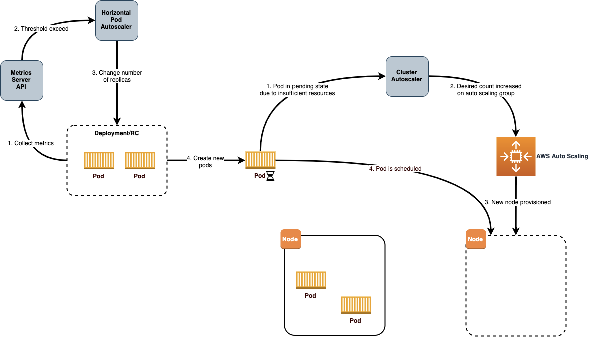
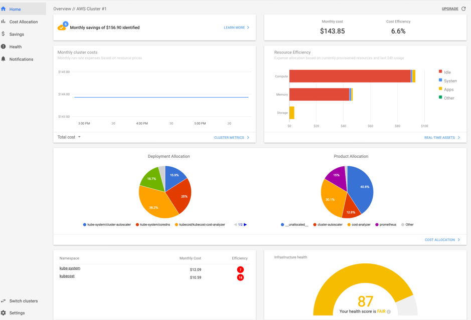

# Amazon EKS Best Practices Guide for Cost Optimization 

The cost optimization best practices includes the continual process of refinement and improvement of a system over its entire lifecycle to constantly look for ways to reduce costs. From your initial design to the ongoing operations of production workloads, adopting the practices specified in this document will help you to build and operate cost-aware systems. By doing so, you can achieve cost-effective business outcomes and maximize your return on investment.

# Design Principles

In the cloud, there are a number of principles that can help you achieve cost optimization of your microservices:

+ Ensure that microservices are independent of specific infrastructure types for running your containers — so that microservices can scale out independently of EC2 Instance types. This is not applicable to AWS Fargate for Amazon EKS. For Amazon EKS with EC2 worker nodes - there can be exceptions like workloads that [require a GPU](https://docs.aws.amazon.com/eks/latest/userguide/gpu-ami.html) or if specific type of EC2 Instance type is required due to the nature of the workload.
+ Select optimally profiled container instances — profile your production or pre-production environments and monitor critical metrics. like CPU and memory, using [Amazon CloudWatch Container Insights for Amazon EKS](https://docs.aws.amazon.com/AmazonCloudWatch/latest/monitoring/deploy-container-insights-EKS.html). 
+ Take advantage of the different purchasing options that are available in AWS, e.g. On-Demand, Spot and Savings Plan.

# Definition

There are three general best practice areas for cost optimization in the cloud:

+ Cost-effective resources (Auto Scaling, Down Scaling and Purchasing Options)
+ Expenditure awareness
+ Optimizing over time (Right Sizing)

As with the other best practices, there are trade-offs to consider. For example, do you want to optimize for speed to market or for cost? In some cases, it’s best to optimize for speed—going to market quickly, shipping new features, or simply meeting a deadline—rather than investing in upfront cost optimization. Design decisions are sometimes guided by haste as opposed to empirical data, as the temptation always exists to overcompensate “just in case” rather than spend time benchmarking for the most cost-optimal deployment. This often leads to drastically over-provisioned and under-optimized deployments. 

## Best Practices

### Cost-effective resources 
**Auto Scaling - Ensure that the infrastructure used to deploy the containerized service matches the application profile and scaling needs.**

Amazon EKS with EC2 managed node groups automate the provisioning and lifecycle management of nodes (Amazon EC2 instances) for Amazon EKS Kubernetes clusters. All managed nodes are provisioned as part of an Amazon EC2 Auto Scaling group that is managed for you by Amazon EKS and all resources including Amazon EC2 instances and Auto Scaling groups run within your AWS account. Amazon EKS tags managed node group resources so that they are configured to use the Kubernetes Cluster Autoscaler. 

The documentation at https://docs.aws.amazon.com/eks/latest/userguide/cluster-autoscaler.html provides detailed guidance on setting up a Managed Node Group and then deploying Kubernetes Cluster Auto Scaler. 

***To create a Kubernetes cluster 1.16 with a single managed group that spans multiple Availability Zones and deploying Kubernetes Cluster AutoScaler on Amazon EKS:***

***Create a EKS cluster with one nodegroup containing 2 m5.large nodes***
```
$ eksctl version
0.19.0
$ eksctl create cluster --name my-cluster-testscaling --version 1.16 --managed --asg-access
```

***Deploy the Cluster Autoscaler for EC2 based Worker Nodes:***
```
$ kubectl apply -f https://raw.githubusercontent.com/kubernetes/autoscaler/master/cluster-autoscaler/cloudprovider/aws/examples/cluster-autoscaler-autodiscover.yaml

$ kubectl -n kube-system annotate deployment.apps/cluster-autoscaler cluster-autoscaler.kubernetes.io/safe-to-evict="false"

$ kubectl -n kube-system edit deployment.apps/cluster-autoscaler

$ kubectl -n kube-system set image deployment.apps/cluster-autoscaler cluster-autoscaler=us.gcr.io/k8s-artifacts-prod/autoscaling/cluster-autoscaler:v1.16.5

$ kubectl -n kube-system logs -f deployment.apps/cluster-autoscaler
```
Cluster Autoscaler logs -


***Deploy Horizontal Pod Autoscaling***

Setup Metrics server:
```

$ kubectl create namespace metrics
$ helm install metrics-server \
    stable/metrics-server \
    --version 2.9.0 \
    --namespace metrics

$ kubectl get --raw "/apis/metrics.k8s.io/v1beta1/nodes"
$ kubectl get apiservice v1beta1.metrics.k8s.io -o yaml
```
Now you can deploy apps which can leverage HPA. Follow https://eksworkshop.com/beginner/080_scaling/test_hpa/ to deploy a sample app, perform a simple load test to test the autoscaling of pods.
```
kubectl run php-apache --image=us.gcr.io/k8s-artifacts-prod/hpa-example --requests=cpu=200m --expose --port=80
```
HPA scales up when CPU exceeds 50% of the allocated container resource, with a minimum of one pod and a maximum of ten pods.
```
kubectl autoscale deployment php-apache --cpu-percent=50 --min=1 --max=10
kubectl get hpa
```
You can then load test the app, and simulate pod autoscaling. 

The combination of Cluster Auto Scaler for the Kubernetes worker nodes and Horizontal Pod Autoscaler for the pods, will ensure that the provisioned resources will be as close to the actual utilization as possible.


(Image source: https://aws.amazon.com/blogs/containers/cost-optimization-for-kubernetes-on-aws/)

Amazon EKS with Fargate

WIP - 

https://docs.aws.amazon.com/eks/latest/userguide/fargate-pod-configuration.html
https://aws.amazon.com/blogs/containers/autoscaling-eks-on-fargate-with-custom-metrics/

**Down Scaling**


**Use pricing models for effective utilization.**


### Expenditure awareness
**Tagging of Resources**

Amazon EKS supports adding AWS tags to your Amazon EKS clusters. This makes it easy to control access to the EKS API for managing your clusters. Tags added to an EKS cluster are specific to the AWS EKS cluster resource, they do not propagate to other AWS resources used by the cluster such as EC2 instances or Load balancers. Today, cluster tagging is supported for all new and existing EKS clusters via the AWS API, Console, and SDKs.

Adding and Listing tags to an EKS cluster:
```
$ aws eks tag-resource --resource-arn arn:aws:eks:us-west-2:xxx:cluster/ekscluster1 --tags team=devops,env=staging,bu=cio,costcenter=1234
$ aws eks list-tags-for-resource --resource-arn arn:aws:eks:us-west-2:xxx:cluster/ekscluster1
{
    "tags": {
        "bu": "cio",
        "env": "staging",
        "costcenter": "1234",
        "team": "devops"
    }
}
```
[After you activate cost allocation tags in the AWS Cost Explorer, AWS uses the cost allocation tags to organize your resource costs on your cost allocation report, to make it easier for you to categorize and track your AWS costs.](https://docs.aws.amazon.com/awsaccountbilling/latest/aboutv2/cost-alloc-tags.html)

**Using AWS Trusted Advisor**

AWS Trusted Advisor offers a rich set of best practice checks and recommendations across five categories: cost optimization; security; fault tolerance; performance; and service limits.

Under Cost Optimization, it helps in eliminating unused and idle resources or making commitments to reserved capacity. The key action items that will help Amazon EKS with EC2 will be around low utilsed EC2 instances, unassociated Elastic IP addresses, Idle Load Balancers, underutilized EBS volumes among other things. The complete list of checks are provided at https://aws.amazon.com/premiumsupport/technology/trusted-advisor/best-practice-checklist/. 

The Trusted Advisor also provides Savings Plan and Reserved Instances recommendations for EC2 instances and Fargate - which allows you to commit to a consistent usage amount in exchange for discounted rates.

**Using third party tools for expenditure awareness**

There are third party tools like [kubecost](https://kubecost.com/), which can also be deployed on Amazon EKS to get visibility into spend of your Kubernetes cluster.

Deploying kubecost using Helm 3:
```
$ curl -sSL https://raw.githubusercontent.com/helm/helm/master/scripts/get-helm-3 | bash
$ helm version --short
v3.2.1+gfe51cd1
$ helm repo add stable https://kubernetes-charts.storage.googleapis.com/
$ helm repo add stable https://kubernetes-charts.storage.googleapis.com/c^C
$ kubectl create namespace kubecost 
namespace/kubecost created
$ helm repo add kubecost https://kubecost.github.io/cost-analyzer/ 
"kubecost" has been added to your repositories

$ helm install kubecost kubecost/cost-analyzer --namespace kubecost --set kubecostToken="aGRoZEBqc2pzLmNvbQ==xm343yadf98"
NAME: kubecost
LAST DEPLOYED: Mon May 18 08:49:05 2020
NAMESPACE: kubecost
STATUS: deployed
REVISION: 1
TEST SUITE: None
NOTES:
--------------------------------------------------Kubecost has been successfully installed. When pods are Ready, you can enable port-forwarding with the following command:
    
    kubectl port-forward --namespace kubecost deployment/kubecost-cost-analyzer 9090
    
Next, navigate to http://localhost:9090 in a web browser.
$ kubectl port-forward --namespace kubecost deployment/kubecost-cost-analyzer 9090

Note: If you are using Cloud 9 or have a need to forward it to a different port like 8080, issue the following command
$ kubectl port-forward --namespace kubecost deployment/kubecost-cost-analyzer 8080:9090

```
Kube Cost Dashboard -


### Optimizing over time (Right Sizing)

Right Sizing as per the AWS Well-Architected Framework, is using “… using the lowest cost resource that still meets the technical specifications of a specific workload”.


### Key AWS Services
Cost optimization is supported by the following AWS services and features:
+ Cost-effective resources – Amazon EC2 provides multiple instance types, such as Reserved Instances and Spot Instances, at different prices.
+ Matching supply and demand – Match user demand with Auto Scaling. Consider Savings Plan (Previously Reserved Instances) for predictable workloads. Use managed data stores for elasticity and durability of the application data.
+ Expenditure awareness – The Billing and Cost Management console dashboard provides an overview of your AWS usage. Use AWS Organizations for granular billing details.
+ Optimizing over time – Amazon CloudWatch Container Metrics provides metrics around usage of resources by the EKS cluster. In addition to the Kubernetes dashboard, there are several tools in the Kubernetes ecosystem that can be used to monitor Kubernetes clusters, such as Prometheus.

### Resources
Refer to the following resources to learn more about AWS best practices for cost optimization.

Videos
+	[AWS re:Invent 2019: Save up to 90% and run production workloads on Spot Instances (CMP331-R1)](https://www.youtube.com/watch?v=7q5AeoKsGJw)

Documentation and Blogs
+	[Cost optimization for Kubernetes on AWS](https://aws.amazon.com/blogs/containers/cost-optimization-for-kubernetes-on-aws/)
+ [Autoscaling EKS on Fargate with custom metrics](https://aws.amazon.com/blogs/containers/autoscaling-eks-on-fargate-with-custom-metrics/)
+	[Using Spot Instances with EKS](https://ec2spotworkshops.com/using_ec2_spot_instances_with_eks.html)
+   [Extending the EKS API: Managed Node Groups](https://aws.amazon.com/blogs/containers/eks-managed-node-groups/)
+	[Autoscaling with Amazon EKS](https://docs.aws.amazon.com/eks/latest/userguide/autoscaling.html) 
+	[Setting Up Container Insights on Amazon EKS and Kubernetes ](https://docs.aws.amazon.com/AmazonCloudWatch/latest/monitoring/deploy-container-insights-EKS.html)
+	[Amazon EKS supports tagging](https://docs.aws.amazon.com/eks/latest/userguide/eks-using-tags.html)
+	[Amazon ECR Lifecycle Policies](https://docs.aws.amazon.com/AmazonECR/latest/userguide/LifecyclePolicies.html)
+	[Amazon EKS-Optimized AMI with GPU Support](https://docs.aws.amazon.com/eks/latest/userguide/gpu-ami.html)
+	[AWS Fargate pricing](https://aws.amazon.com/fargate/pricing/)
+   [Amazon EKS on AWS Fargate](https://aws.amazon.com/blogs/aws/amazon-eks-on-aws-fargate-now-generally-available/)
+	[Amazon EKS pricing](https://aws.amazon.com/eks/pricing/)

Tools
+	[AWS Organizations](https://aws.amazon.com/organizations/)
+	[What is AWS Billing and Cost Management?](https://docs.aws.amazon.com/awsaccountbilling/latest/aboutv2/cost-alloc-tags.html)
+   [Third party - Kube Cost](https://kubecost.com/)

