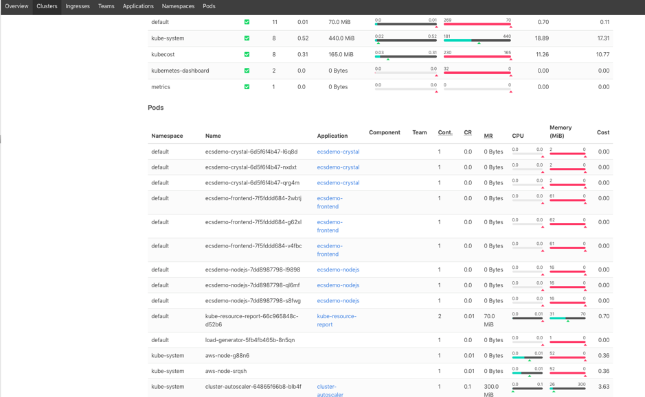
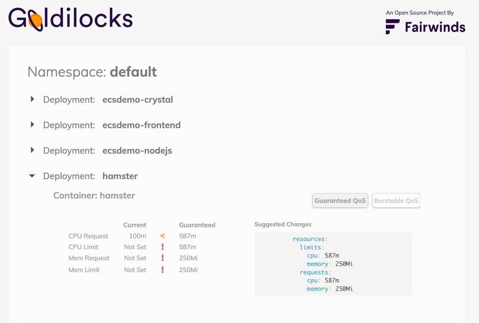

### 3. Optimizing over time (Right Sizing)

Right Sizing as per the AWS Well-Architected Framework, is using “… using the lowest cost resource that still meets the technical specifications of a specific workload”.

In Kubernetes, this means setting the right CPU and Memory for Amazon EKS on AWS Fargate and selecting the right EC2 Instance type, for running containers on Pods. The details of how Kubernetes manages resources for containers are given in the [documentation](https://kubernetes.io/docs/concepts/configuration/manage-resources-containers/).

***Amazon EKS on AWS Fargate***
When pods are scheduled on Fargate, the vCPU and memory reservations within the pod specification determine how much CPU and memory to provision for the pod. 

The list of vCPU and memory combinations that are available for pods running on Fargate are listed in the [Amazon EKS User Guide](https://docs.aws.amazon.com/eks/latest/userguide/fargate-pod-configuration.html). If you do not specify a vCPU and memory combination, then the smallest available combination is used (.25 vCPU and 0.5 GB memory). 

***Amazon EKS on EC2***

When we specify a Pod, we can specify how much of each resource like CPU and Memory, a Container needs. It is important we do not over-provision or under-provision the resources allocated to the containers. 

There are tools like [kube resource report](https://github.com/hjacobs/kube-resource-report) which can help with right sizing of pods deployed on Amazpn EKS with EC2 nodes.

Deployment steps for kube resource report (the installation of helm is covered in the previous section on deploying kube cost :
```
$ git clone https://github.com/hjacobs/kube-resource-report
$ cd kube-resource-report
$ helm install kube-resource-report ./unsupported/chart/kube-resource-report
$ helm status kube-resource-report
$ export POD_NAME=$(kubectl get pods --namespace default -l "app.kubernetes.io/name=kube-resource-report,app.kubernetes.io/instance=kube-resource-report" -o jsonpath="{.items[0].metadata.name}")
$ echo "Visit http://127.0.0.1:8080 to use your application"
$ kubectl port-forward $POD_NAME 8080:8080
```
Screenshots from a sample reports from this tool:




***FairwindsOps Goldilocks***

The [FairwindsOps Goldilocks](https://github.com/FairwindsOps/goldilocks) is a tool that creates a Vertical Pod Autoscaler (VPA) for each deployment in a namespace and then queries them for information. Once the VPAs are in place, we see recommendations appear in the Goldilocks dashboard.

*Deployment:*

Deploy the Vertical Pod Autoscaler as per the [documentation]( https://docs.aws.amazon.com/eks/latest/userguide/vertical-pod-autoscaler.html).

```
$ helm repo add fairwinds-stable https://charts.fairwinds.com/stable
$ kubectl create namespace goldilocks
$ helm install goldilocks --namespace goldilocks fairwinds-stable/goldilocks
```

Enable Namespace - Pick an application namespace and label it like so in order to see some data, in the following example we are specifying the default namespace:

```
$ kubectl label ns default goldilocks.fairwinds.com/enabled=true
```

Viewing the Dashboard - The default installation creates a ClusterIP service for the dashboard. You can access via port forward:

```
$ kubectl -n goldilocks port-forward svc/goldilocks-dashboard 8080:80
```

Then open your browser to http://localhost:8080




***Right Size Guide***

The [right size guide (rsg)](https://mhausenblas.info/right-size-guide/) is a simple CLI tool that provides you with memory and CPU recommendations for your application. This tool works across container orchestrators, including Kubernesta and easyto deploy. 

### Resources
Refer to the following resources to learn more about best practices for cost optimization.


Documentation and Blogs
+	[Amazon EKS-Optimized AMI with GPU Support](https://docs.aws.amazon.com/eks/latest/userguide/gpu-ami.html)


Tools
+  [Kube resource report](https://github.com/hjacobs/kube-resource-report)
+  [Right size guide](https://github.com/mhausenblas/right-size-guide)
+ [Fargate count](https://github.com/mreferre/fargatecount)
+ [FairwindsOps Goldilocks](https://github.com/FairwindsOps/goldilocks)


