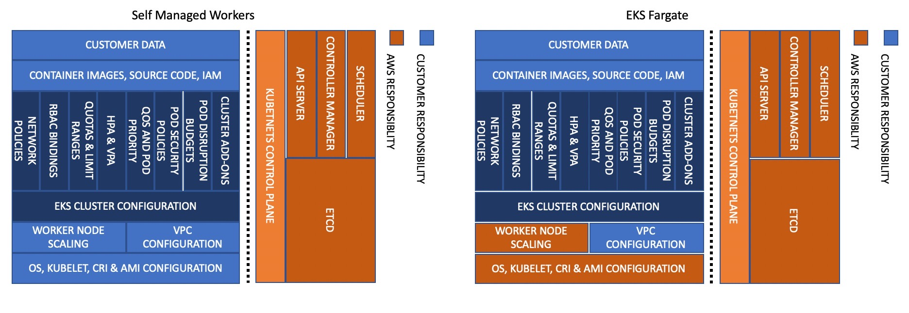
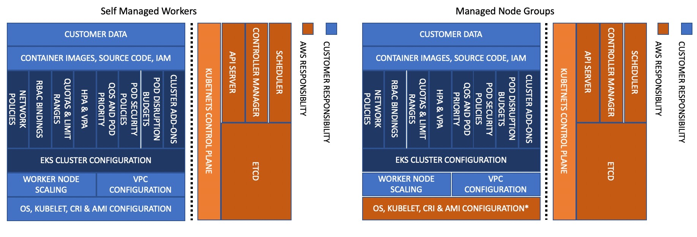

# Amazon EKS Best Practices Guide for Reliability

This section provides guidance about making workloads running on EKS resilient and highly-available  

## How to use this guide

This guide is meant for developers and architects who want to develop and operate highly-available and fault-tolerant services in EKS. The guide is organized into different topic areas for easier consumption. Each topic starts with a brief overview, followed by a list of recommendations and best practices for reliability your EKS clusters.

## Introduction

The reliability best practices for EKS have been grouped under the following topics:
* Control Plane 
* Network Management
* Data Plane Management
* Automated Scaling
* Automated Recovery
* Observability
* Resource Management

What makes a system reliable? If a system is able to function consistently and meet demands inspite of changes in its environment over a period of time, then it can be called reliable. To get to this state, the system has to detect failures, automatically heal itself and have the ability to scale based on demand. 

Customers can use Kubernetes as a foundation to operate mission-critical applications and services reliably. But aside from incorporating container-based application design principles, running workloads reliably also requires a reliable infrastructure. In Kubernetes, infrastructure comprises control plane and data plane. 

EKS provides a production-grade Kubernetes control plane that is designed to be highly-available and fault-tolerant. 

In EKS, AWS is responsible for the reliability of the Kubernetes control plane. EKS runs Kubernetes control plane across three availability zones in an AWS Region. EKS automatically manages the availability and scalability of the Kubernetes API servers and the etcd cluster. EKS automatically detects and replaces unhealthy master nodes.

The responsibility for the reliability of the data plane is shared between the you, the customer, and AWS. EKS offers three options for Kubernetes data plane. Fargate, which is the most managed option, handles provisioning and scaling of the data plane. The second option, managed nodes groups handles provisioning and updates of the data plane. And finally, self-managed nodes is the least managed option for the data plane. The more AWS-managed data plane you use, the less responsibility you have.

This guide includes a set of recommendations that you can use to improve the reliability of your EKS data plane, Kubernetes core components and your applications.

## Feedback
This guide is being released on GitHub so as to collect direct feedback and suggestions from the broader EKS/Kubernetes community. If you have a best practice that you feel we ought to include in the guide, please file an issue or submit a PR in the GitHub repository. Our intention is to update the guide periodically as new features are added to the service or when a new best practice evolves.

