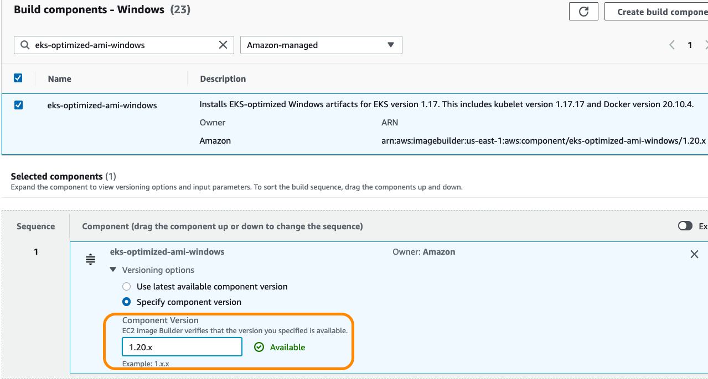
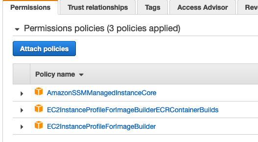

# Amazon EKS optimized Windows AMI management
The Amazon EKS optimized AMI is built on top of Windows Server 2019, and is configured to serve as the base image for Amazon EKS Windows nodes. The AMI is configured to work with Amazon EKS out of the box, and it includes Docker, the kubelet, and the AWS IAM Authenticator. 

You can programmatically retrieve the Amazon Machine Image (AMI) ID for Amazon EKS optimized AMIs by querying the AWS Systems Manager Parameter Store API. This parameter eliminates the need for you to manually look up Amazon EKS optimized AMI IDs. For more information about the Systems Manager Parameter Store API, see [GetParameter](https://docs.aws.amazon.com/systems-manager/latest/APIReference/API_GetParameter.html). Your user account must have the ssm:GetParameter IAM permission to retrieve the Amazon EKS optimized AMI metadata.

The following example retrieves the AMI ID for the latest Amazon EKS optimized AMI for Windows Server 2019 LTSC Core. The version number listed in the AMI name relates to the corresponding Kubernetes build it is prepared for.

```bash    
aws ssm get-parameter --name /aws/service/ami-windows-latest/Windows_Server-2019-English-Core-EKS_Optimized-1.21/image_id --region us-east-1 --query "Parameter.Value" --output text
```

Example output:

```
ami-09770b3eec4552d4e
```

## Managing your own Amazon EKS optimized Windows AMI

An essential step towards production environments is maintaining the same Amazon EKS optimized Windows AMI and kubelet version across the Amazon EKS cluster. 

Using the same version across the Amazon EKS cluster reduces the time during troubleshooting and increases cluster consistency. [Amazon EC2 Image Builder](https://aws.amazon.com/image-builder/) helps create and maintain custom Amazon EKS optimized Windows AMIs to be used across an Amazon EKS cluster.

Use Amazon EC2 Image Builder to select between Windows Server versions, AWS Windows Server AMI release dates, and/or OS build version. The build components step, allows you to select between existing EKS Optimized Windows Artifacts as well as the kubelet versions. For more information: https://docs.aws.amazon.com/eks/latest/userguide/eks-custom-ami-windows.html



**NOTE:** Prior to selecting a base image, consult the [Windows Server Version and License](licensing.md) section for important details pertaining to release channel updates.

## Configuring faster launching for custom EKS optimized AMIs ##

When using a custom EKS Optimized AMI, Windows worker nodes can be launched up to 65% faster by enabling the Fast Launch feature. This feature maintains a set of pre-provisioned snapshots which have the _Sysprep specialize_, _Windows Out of Box Experience (OOBE)_ steps and required reboots already completed. These snapshots are then used on subsequent launches, reducing the time to scale-out or replace nodes. Fast Launch can be only enabled for AMIs *you own* through the EC2 console or in the AWS CLI and the number of snapshots maintained is configurable. 
> :warning: **Fast Launch is not compatible with the default Amazon-provided EKS optimized AMI**, create a custom AMI as above before attempting to enable it. 
 
For more information: [AWS Windows AMIs - Configure your AMI for faster launching](https://docs.aws.amazon.com/AWSEC2/latest/WindowsGuide/windows-ami-version-history.html#win-ami-config-fast-launch)

## Caching Windows base layers on custom AMIs ##

Windows container images are larger than their Linux counterparts.  A base image of Windows Server 2019 LTSC Core is 5.74GB on disk.  If you are running the full suite of .NET Framework 4.8 on the same base image, the size grows to 8.24GB.  It is essential to implement a Windows base layer caching strategy while using Auto-Scaling through [Cluster Autoscaler](https://docs.aws.amazon.com/eks/latest/userguide/cluster-autoscaler.html) in order to avoid delays during a pod launch on a new Windows node.

Pulling the image from the repository isn't an expensive operation for the OS; however, the **extraction** operation may take minutes depending on the size and number of layers an image contains.

As mentioned in the **Patching Windows Server and Container** topic, there is an option to build a custom AMI with EKS. During the AMI preparation, you can add an additional EC2 Image builder component to pull all the necessary Windows container images locally and then generate the AMI. This strategy will drastically reduce the time a pod reaches the status **Running**. 

On Amazon EC2 Image Builder, create a [component](https://docs.aws.amazon.com/imagebuilder/latest/userguide/manage-components.html) to download the necessary images and attach it to the Image recipe. The following example pulls a specific image from a ECR repository. 

```
name: DockerPull
description: This component pulls the necessary containers images for a cache strategy.
schemaVersion: 1.0

phases:
  - name: build
    steps:
      - name: Dockerpull
        action: ExecutePowerShell
        inputs:
          commands:
            - Set-ExecutionPolicy Unrestricted -Force
            - (Get-ECRLoginCommand).Password | docker login --username AWS --password-stdin 111000111000.dkr.ecr.us-east-1.amazonaws.com
            - docker pull 111000111000.dkr.ecr.us-east-1.amazonaws.com/fluentd-windows-servercore-ltsc2019
```

To make sure the following component works as expected, check if the IAM role used by EC2 Image builder (EC2InstanceProfileForImageBuilder) has the attached policies:




