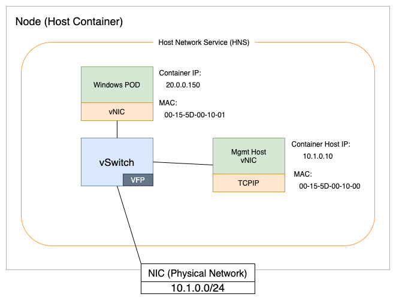

# Windows Networking

## Windows Container Networking Overview
Windows containers use fundamentally different than Linux containers. Linux containers use Linux constructs like namespaces, the union file system, and cgroups. On Windows, those constructs are abstracted from Docker by the Host Compute Service (HCS). HCS acts as an API layer that sits above the container implementation on Windows. Windows containers also leverage the Host Network Service (HNS) that defines the network topology on a node. 



From a networking perspective, HCS and HNS make Windows containers function like virtual machines. For example, each container has a virtual network adapter (vNIC) that is connected to a Hyper-V virtual switch (vSwitch) as shown in the diagram above.

## IP Management
Windows Server uses an Elastic Network Interface (ENI) to connect to an AWS VPC network. The EKS Container Network Interface (CNI) for Windows currently supports only one ENI per worker node. The number of pods that a Windows worker node can support is dictated by the size and type of the instance. You can calculate max pods using the following forumula: 

_(number of primary ENIs * IP Addresses per Interface) - 3 = Total IP addresses available for Pods_

We subtract 3 IP addresses from the total because the worker node requires one IP for itself, one for the VPC CNI, and one more for kube-proxy. 

Using the formula above, we can calculate max pods for an m5.large instance. 

_(1 primary ENI * 10 secondary IPs per ENI) - 3 = 7_

The reason it only support 7 is because the CNI only allows us to use the worker node's primary ENI. Also each ENI on an m5.large supports 10 secondary IP addresses, so we subtract 3 from 10 to get our total of 7 IP addresses.

For more information on how many IP addresses an instance type can support, see [IP addresses per network interface per instance type](https://docs.aws.amazon.com/AWSEC2/latest/UserGuide/using-eni.html#AvailableIpPerENI). 

Another key consideration is the flow of network traffic. With Windows there is a risk of port exhaustion on nodes with more than 100 services. When this condition arises, the nodes will start throwing errors with the following message:

**"Policy creation failed: hcnCreateLoadBalancer failed in Win32: The specified port already exists."**

To address this issue, we leverage Direct Server Return (DSR). DSR is an implementation of asymmetric network load distribution. In other words, the request and response traffic use different network paths. This feature speeds up communication between pods and reduces the risk of port exhaustion. We therefore recommend enabling DSR on Windows nodes. 

 DSR is enabled by default in Windows Server SAC EKS Optimized AMIs. For Windows Server 2019 LTSC EKS Optimized AMIs, you will need to enable it during instance provisioning using the script below and by specifying WindowsServer2019CoreContainer as the amiFamily in the `eksctl` nodeGroup. See [eksctl custom AMI](https://eksctl.io/usage/custom-ami-support/) for additional information. 

```yaml
nodeGroups:
- name: windows-ng
  instanceType: c5.xlarge
  minSize: 1
  volumeSize: 50
  amiFamily: WindowsServer2019CoreContainer
  ssh:
    allow: false
```
In order to utilize DSR in Windows Server 2019 and above, you will need to specify the following [**kube-proxy**](https://kubernetes.io/docs/setup/production-environment/windows/intro-windows-in-kubernetes/) flags during instance startup:

```powershell
<powershell>
  [string]$EKSBinDir = “$env:ProgramFiles\Amazon\EKS”
  [string]$EKSBootstrapScriptName = ‘Start-EKSBootstrap.ps1’
  [string]$EKSBootstrapScriptFile = “$EKSBinDir\$EKSBootstrapScriptName”
  [string]$cfn_signal = “$env:ProgramFiles\Amazon\cfn-bootstrap\cfn-signal.exe”
  & $EKSBootstrapScriptFile -EKSClusterName ${ClusterName} ${BootstrapArguments} --feature-gates=“WinDSR=true” --enable-dsr=true 3>&1 4>&1 5>&1 6>&1
  $LastError = if ($?) { 0 } else { $Error[0].Exception.HResult }
  & $cfn_signal --exit-code=$LastError `
    --stack=“${AWS::StackName}” `
    --resource=“NodeGroup” `
    --region=${AWS::Region}
</powershell>
```

DSR enablement can be verified following the instructions in the [Microsoft Networking blog](https://techcommunity.microsoft.com/t5/networking-blog/direct-server-return-dsr-in-a-nutshell/ba-p/693710).

Using an older versions of Windows will increase the risk of port exhaustion as those versions do not support DSR. 

## Container Network Interface (CNI) options
The AWSVPC CNI is the de facto CNI plugin for Windows and Linux worker nodes. While the AWSVPC CNI satisfies the needs of many customers, still there may be times when you need to consider alternatives like an overlay network to avoid IP exhaustion. In these cases, the Calico CNI can be used in place of the AWSVPC CNI. [Project Calico](https://www.projectcalico.org/) is open source software that was developed by [Tigera](https://www.tigera.io/). That software includes a CNI that works with EKS. Instructions for installing Calico CNI in EKS can be found on the [Project Calico EKS installation](https://docs.projectcalico.org/getting-started/kubernetes/managed-public-cloud/eks) page.

## Network Polices 
It is considered a best practice to change from the default mode of open communication between pods on your Kubernetes cluster to limiting access based on network polices. The open source [Project Calico](https://www.tigera.io/tigera-products/calico/) has strong support for network polices that work with both Linux and Windows nodes. This feature is separate and not dependent on using the Calico CNI. We therefore recommend installing Calico and using it for network policy management. 

Instructions for installing Calico in EKS can be found on the [Installing Calico on Amazon EKS](https://docs.aws.amazon.com/eks/latest/userguide/calico.html) page.

In addition, the advice provided in the [Amazon EKS Best Practices Guide for Security - Network Section](https://aws.github.io/aws-eks-best-practices/security/docs/network/) applies equally to EKS clusters with Windows worker nodes, however, some features like "Security Groups for Pods" are not supported by Windows at this time.
